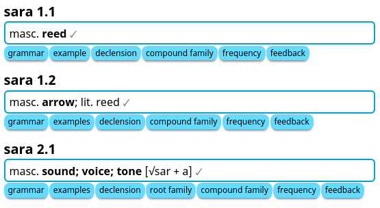
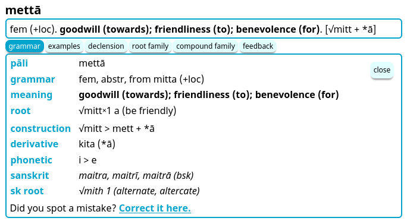
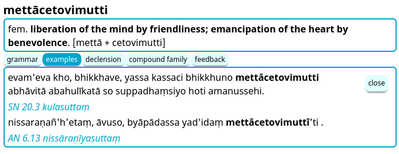
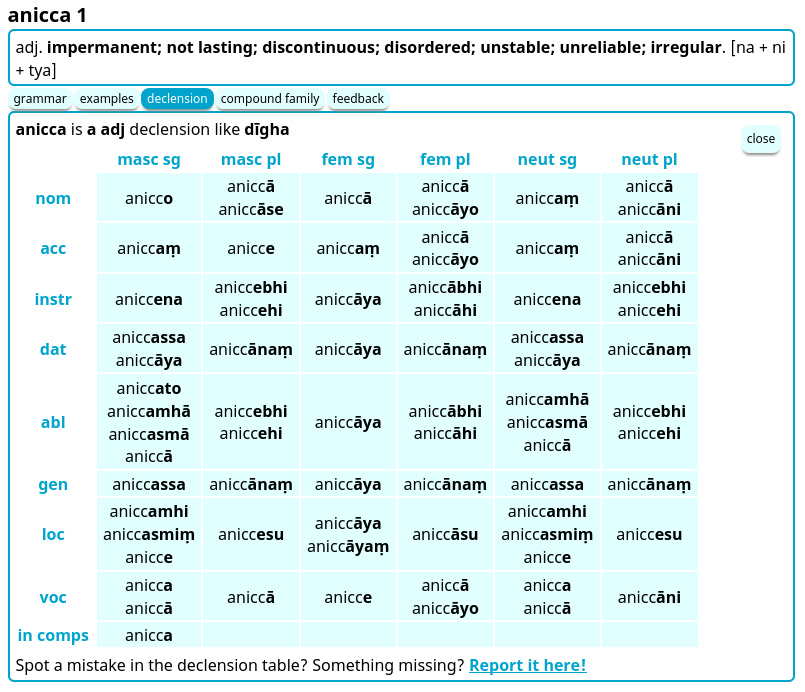
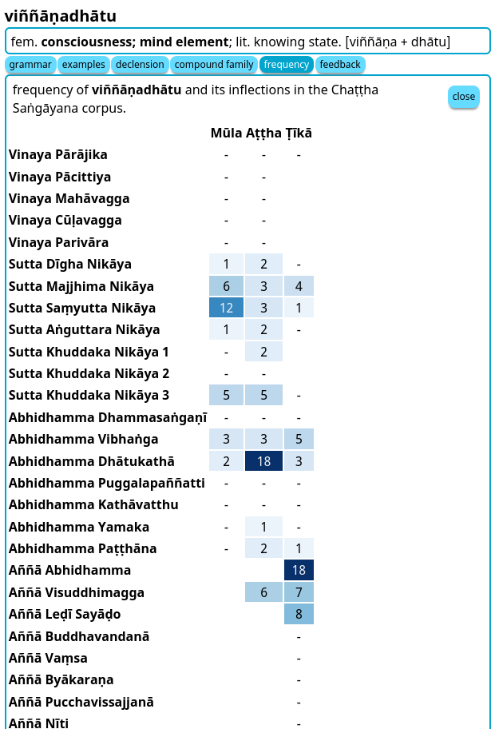
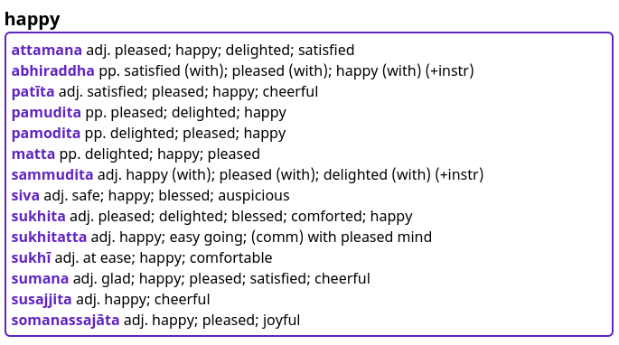
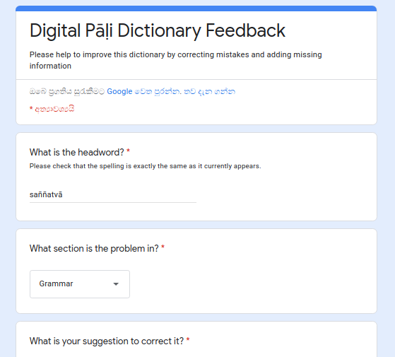
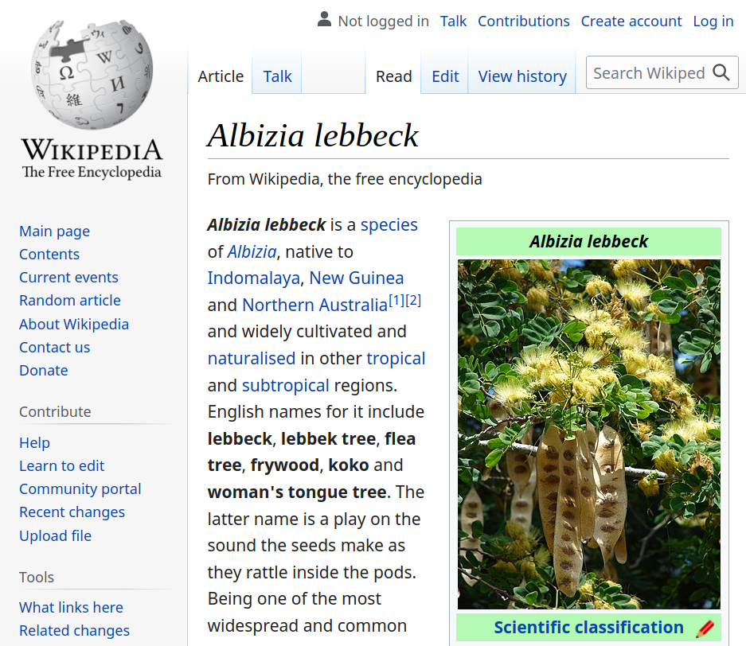

# Features

## DPD contains five different dictionaries

#### Pāḷi to English Dictionary (Blue)

#### Pāḷi Roots Dictionary (Orange)

 \

for more info [click here](rootdict.md)

#### English to Pāḷi Dictionary (Purple)

#### Compound Deconstruction Dictionary (Sand)

#### Abbreviations and Help Dictionary (Green)

## DPD recognises 1.1 million unique inflected forms of Pāḷi words

When you select on a word in a Pāḷi text and press the hotkey, DPD automatically recognizes all the headwords to which that inflected form belongs. For example, clicking on _takkarassa_ will automatically open _takkara_. 

## 100% Dictionary recognition in these books

DPD recognizes all words, both in Chaṭṭha Saṅgāyana Tipiṭaka and Mahāsaṅgīti edition on Sutta Central, including all compounds and sandhis, in the following books:

**Vinaya**: Pārājikapāḷi , Pācittiyapāḷi \
**Sutta**: Dīgha Nikāya, Majjhima Nikāya, Saṃyutta Nikāya, Aṅguttara Nikāya Books 1, 2, 3, 4, 5 \
**Up Next**: Aṅguttara Nikāya Books 6 & 7

## Click on everything

One of the great features about GoldenDict is the ability to click on any word to open up the definition of that word. This creates an infinite web of language discovery.

## Compact Presentation

All the important Pāḷi information is presented in **one compact line**, available at a glance. More detailed information is available by clicking the buttons.

Essential information includes the part of speech, case which the word takes, English meaning, literal meaning and simplified construction.

## Numbering System

If words with multiple meanings are derived from different sources, their numbering will reflect that. 

In the example above, 1.1 and 1.2 both are related to Sanskrit *śara* , while 2.1 is derived from the root √sar (to make sound), Sansksrit *svara*.

## Grammar

Click the **grammar** button to get more more detailed grammatical information about the word.

This includes root information, detailed construction, derivative, phonetic changes, compound, antonyms, synonyms, commentarial glosses, non-Indo-Aryan cognates, Sanskrit cognates and Sanskrit root.

If you spot a mistake, please click the link to correct it.

## Examples

Click the **examples** button to see relevant sutta examples of the word. 

If you can think of a better example, please let me know!

## Declension / Conjugation

Click the **declension** or **conjugation** button to see all the inflected forms of a word. 

This table is automatically generated using a stem + pattern system, e.g. anicc + o. Irregular inflections have their own unique tables.

## Root Family

Click the **root family** button to see all words which have the same prefix + root.

This information is unique to DPD and is based on a detailed study of the Pāḷi and Sanskrit root system. It's great for getting to know the nuanced range of meanings that a root + prefix combination can display.

## Word Family

Click the **word family** button to see all related words which are not derived from a root, created from the primary word using prefixes and suffixes.

## Compound Family 

Click the **compound family** button to see a collection of all the compounds which contain a particular word.

If the headword itself is a compound, all compound families of the component words will be listed.

## Word Frequency

Click the **frequency** button to see a heat map of where & how often a word can be found in the Chaṭṭha Saṅgāyana corpus.

[Click here](frequency.md) for more detailed information on this interesting feature. 

## English to Pāḷi Dictionary

You can now access the English to Pāḷi dictionary simply by **clicking on any English word** in GoldenDict. That brings up a list of __exact__ matches.

Or you can use the **search bar** to find a word, phrase or idiom. The dropdown list will display all possible options.

Or you can highlight any word, phrase or idiom and use the **hotkey**.

This feature is designed for beginners struggling with English to Pāḷi exercises, and more advanced students learning to communicate in Pāḷi. 

## Sinhala, Devanagari and Thai Scripts

Good news for those who read Pāḷi in Sinhala, Devanagari or Thai scripts, DPD recognizes all inflected forms in all three of these scripts.

Transliteration is based on [Aksharamukha Script Converter](https://aksharamukha.appspot.com/about).

## Feedback

One of the most important aspects of DPD is the feedback loop. When you spot a mistake, please click the link to correct it. That opens up a Google form which is pre-filled with the headword. 

It generally takes less than a minute to log an error, and helps to improve the quality of the dictionary for everyone who uses it.

## Wikipedia links

All flowers, trees, plants and unusual animals contain a link to a Wikipedia article for more detailed information on the topic. Indian plants are often used in early Buddhist similes, and a picture is worth a thousand words.

## Fonts

If you prefer a sans-serif font, please install [Noto Sans](https://fonts.google.com/noto/specimen/Noto+Sans), it works well with Pāḷi diacritics. If you prefer a serif font, please install [Deja Vu Serif](https://www.fontsquirrel.com/fonts/dejavu-serif), or [Verajja Serif](https://en.m.fontke.com/font/10186264/), a specially created font for Pāḷi text.

## Word Data's Degree of Completion

As DPD is a work in progress, it is useful to know how complete a word's data is. This is indicated by a gray icon (✓~✗) after the entry.  

✓ a gray tick means the word data is mostly complete with contextual meaning, grammar, sutta example and other relevant information. 

~  a gray dash means the word data is partially complete with a meaning in context and grammatical construction, but minimal other information.

✗ a gray cross means the word data is still under construction with only an inflection table, frequency table and very basic information.

----------------------

Enough in theory, here's how to get GoldenDict installed and setup on your machine ([Win](install_win.md) / [Mac](install_mac.md) / [Linux](install_linux.md) / [Android](install_android_mdict.md)) or [update](update.md) once a month if you're already installed.